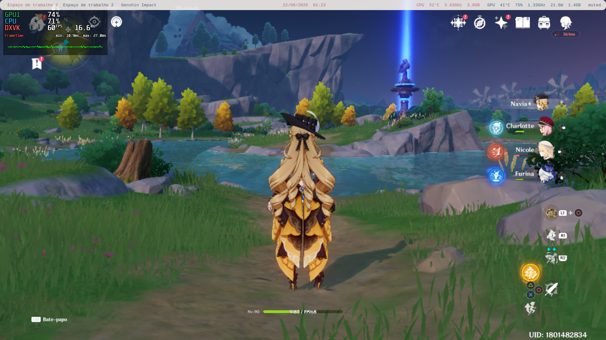
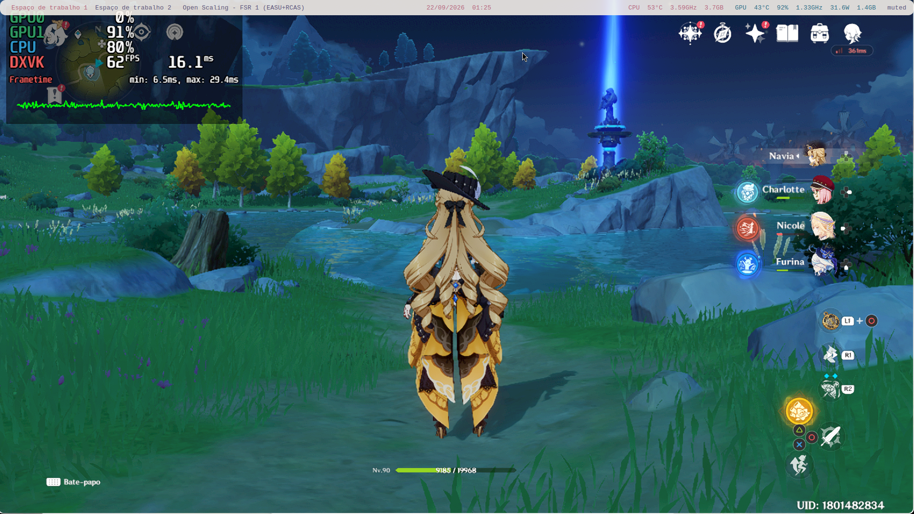
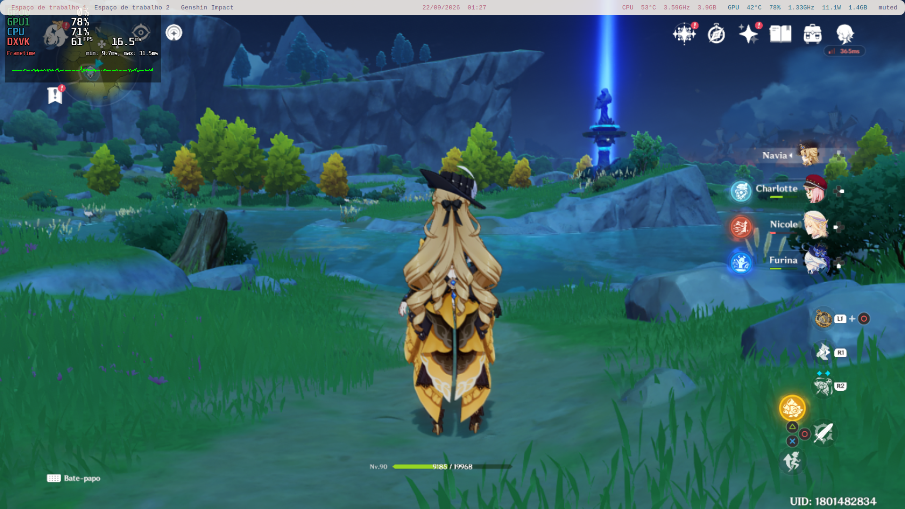
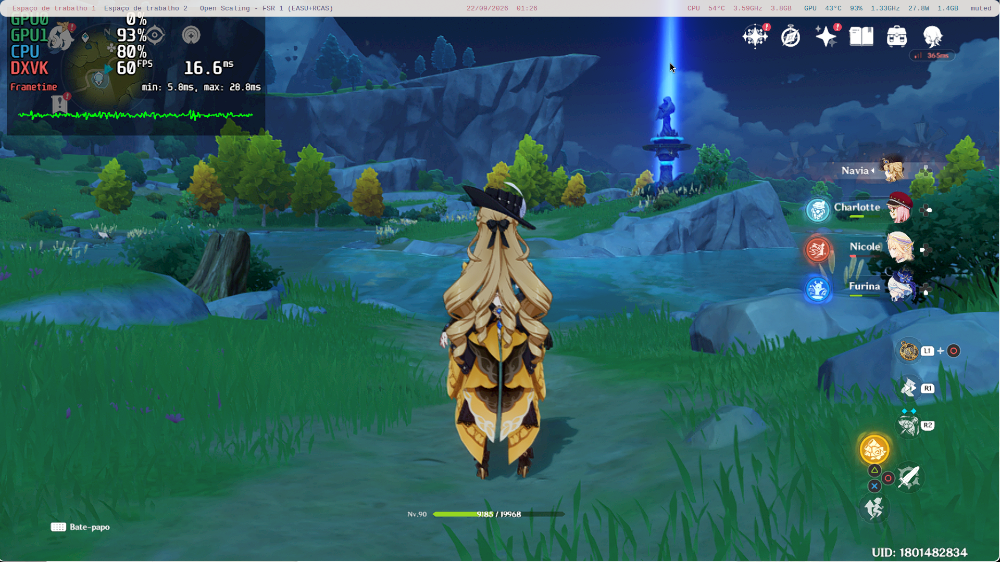

# Open-Scaling

Upscaler de tela em tempo real para **X11 / XFCE**, usando **AMD FSR 1.0 (FidelityFX Super Resolution)** com os filtros **EASU + RCAS**.

Captura a janela de um jogo ou aplicativo em execução e aplica o upscaling da imagem em tempo real, melhorando a nitidez e o desempenho em jogos **(ainda com MUITOS bugs de input)** que rodam em resoluções menores ou sem suporte nativo a FSR.

## Como funciona

- Captura a tela/janela via **X11**.
- Aplica o **FSR 1.0** (EASU para upscaling espacial + RCAS para nitidez).
- Exibe o resultado em uma janela de preview (Vulkan).

## Status

- ⚠️**Beta**: em desenvolvimento ativo.
- 🪳 Ainda possui bugs conhecidos que estou trabalhando para corrigir.
- ⚠️ **Compatibilidade:** roda apenas em **XFCE / X11**. Wayland não é suportado no momento.
- ❗Problemas de desempenho em CPUs e GPUs antigas, testes feitos em DDR3 plataforma 1155

##NOTA UPDATES

- Fiz alguns fixes no metodo de entrada, ainda pode quebrar dependendo do programa. Recomendo usar em jogos com ponteiro/indicador própio, Open Scaling ainda não possui a função trazer o ponteiro do desktop para a janela

## Exemplos

- **Exemplos não são do estado atual do projeto.**

| Nativo (Sem Scaling) | Open-Scaling (FSR 1 - EASU+RCAS) |
|---|---|
|  |  |
|  |  |

## Como rodar

```bash
./start.sh