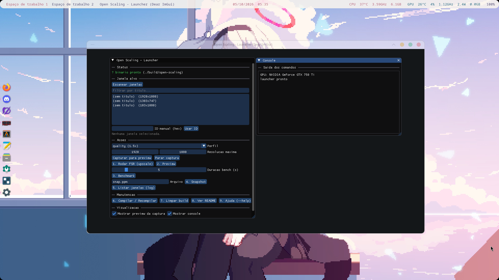
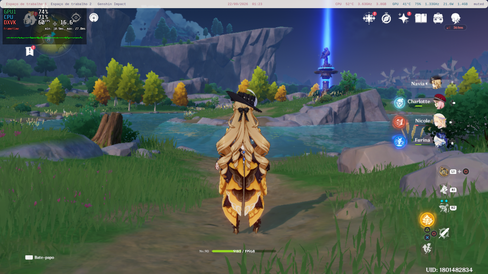
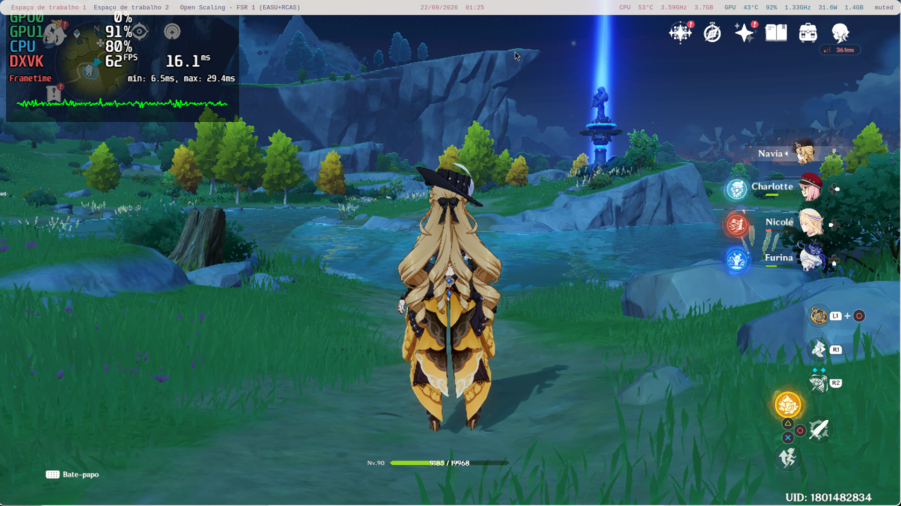
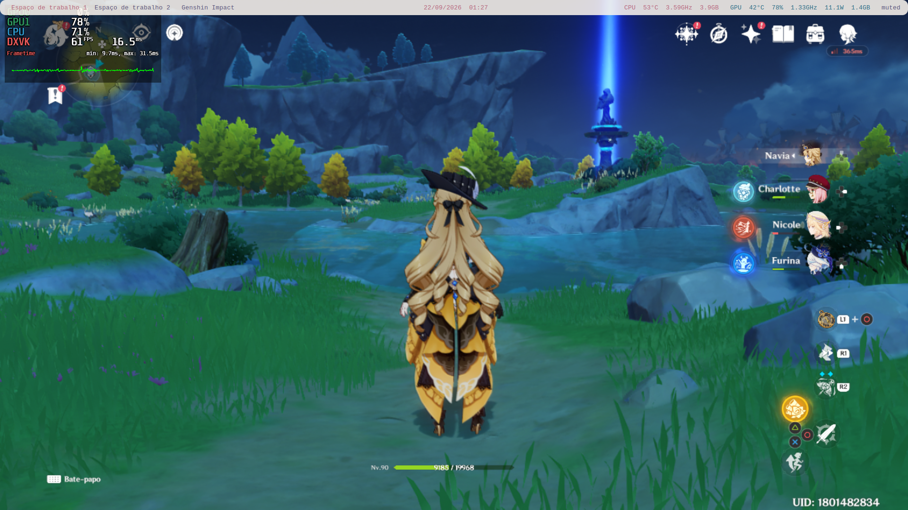
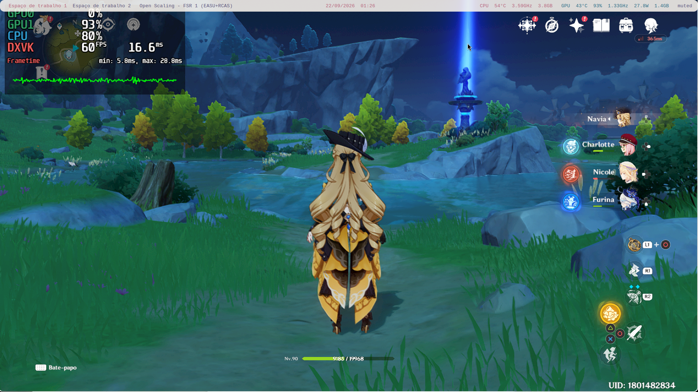

# Open-Scaling v0.30 (Beta)


Upscaler de tela em tempo real para **X11 / XFCE**, usando **AMD FSR 1.0** (FidelityFX Super Resolution) com os filtros **EASU + RCAS**.

Captura a janela de um jogo ou aplicativo em execução e aplica o upscaling da imagem em tempo real, melhorando a nitidez e o desempenho em jogos que rodam em resoluções menores ou sem suporte nativo a FSR **(ainda com bugs conhecidos de input)**.

---

## 🛠️ Como funciona

- Captura a tela/janela via **X11**.
- Aplica o **FSR 1.0** (EASU para upscaling espacial + RCAS para nitidez).
- Exibe o resultado em uma janela de preview via **Vulkan**.
- No modo FSR, uma thread dedicada captura a até 60 FPS e o renderizador consome o frame mais recente concluído, evitando bloquear o envio de trabalho à GPU pela espera do X11.
- A apresentação prefere **MAILBOX** quando suportado, para descartar frames antigos na fila; usa **FIFO** como fallback.
- A geração RIFE é opcional e se comunica com o serviço independente Open-FrameFlow por socket Unix; sem o serviço, o FSR funciona normalmente.

---

## 📊 Status do Projeto

- ⚠️ **Beta**: Em desenvolvimento ativo.
- 🪳 Possui bugs conhecidos de input/captura que estão sendo corrigidos.
- ⚠️ **Compatibilidade:** Roda apenas em **XFCE / X11**. O protocolo Wayland não é suportado no momento.
- ❗ **Desempenho:** Pode apresentar gargalos em CPUs e GPUs mais antigas (testes realizados na plataforma LGA 1155 com memória DDR3).

---

## 📦 Requisitos

- **SO:** Linux com servidor gráfico **X11** (XFCE recomendado)
- **GPU:** Compatível com **Vulkan** (drivers AMD, Intel ou NVIDIA atualizados)
- **Compilador:** `gcc` ou `clang` com suporte a C++17
- **Bibliotecas de desenvolvimento:**
  - `libvulkan-dev`
  - `libx11-dev`
  - `libxcomposite-dev`
  - `libxrandr-dev`
  - `libxinerama-dev`
  - `libxcursor-dev`
  - `libxi-dev`
  - `cmake` (>= 3.15) e `make`
- **Runtime:** `vulkan-tools` (opcional, para diagnóstico)

> Em distros baseadas em Debian/Ubuntu:
> ```bash
> sudo apt install build-essential cmake libvulkan-dev libx11-dev \
>   libxcomposite-dev libxrandr-dev libxinerama-dev libxcursor-dev libxi-dev
> ```

---

## ⚙️ Instalação / Build

1. Clone o repositório:
   ```bash
   git clone https://github.com/vinihoelzel-dev/Open-Scaling
   cd Open-Scaling
   ```

2. Torne os scripts executáveis:
   ```bash
   chmod +x start.sh ui.sh
   ```

3. Compile e execute pelo menu interativo:
   ```bash
   ./start.sh
   ```

   Ou abra direto o launcher gráfico:
   ```bash
   ./ui.sh
   ```

Habilite geração de frames com `--framegen 2`, `--framegen 3` ou
`--framegen 4`. O serviço Open-FrameFlow continua sendo um executável separado,
mas `start.sh` e a GUI podem iniciá-lo e encerrá-lo automaticamente. Aponte
`OPEN_FRAMEFLOW_BIN` e `OPEN_FRAMEFLOW_MODEL` para personalizar os caminhos; na
GUI ambos também podem ser editados antes de iniciar o FSR. O launcher permite
escolher RIFE na GPU ou Optical Flow DIS na CPU. O DIS não precisa de modelo
RIFE, usa a resolução recebida e reduz a carga de geração na GPU, transferindo
trabalho para a CPU; não há garantia de que acompanhe o FPS em todo hardware.
Para compilar o Open-FrameFlow com DIS, instale `libopencv-dev`.
No modo FrameFlow, o Open-Scaling prefere automaticamente uma GPU integrada que
suporte apresentação Vulkan, para renderizar no adaptador associado à tela; o
serviço RIFE continua independente e pode usar a GPU dedicada. `--vk-gpu INDEX`
seleciona explicitamente um índice da lista Vulkan impressa no início, e
`--vk-gpu auto` volta à seleção automática.
O modo de framegen usa FIFO/VSync e apresenta na ordem cada quadro de origem e
seus intermediários RIFE. A captura reduz sua cadência de origem para que o
multiplicador caiba na taxa de atualização do monitor (por exemplo, 30→60 FPS
com fator 2 em uma tela de 60 Hz). Com o serviço ativo, o VSync controla a
cadência de apresentação, sem um segundo limitador de FPS no loop. Se a
inferência não acompanhar, a apresentação espera pelo quadro esperado em vez de
substituí-lo por um quadro fora de ordem; isso pode aumentar a latência, que é
limitada por filas curtas e backpressure.
Na inicialização de framegen, o launcher permite selecionar o modelo RIFE
original, uma pasta já quantizada em INT8 ou DIS na CPU. INT8 requer um
`flownet.param` e
`flownet.bin` convertidos e calibrados; essa seleção não converte o modelo.
O servidor verifica a presença de camadas INT8 no parâmetro antes de aceitar
essa opção.

---

## 📝 Notas de Atualização (Updates)

- **Fixes no método de entrada:** Pequenas correções aplicadas, mas o input ainda pode falhar dependendo do programa. Recomenda-se o uso em jogos que possuem ponteiro/indicador próprio, pois o Open-Scaling ainda não traz o ponteiro do desktop automaticamente para dentro da janela de preview.
- **Tempo de resposta:** Melhorias relevantes na latência de exibição. O objetivo atual é reduzir ainda mais o *image-lag* (tempo de resposta em ms).
- **Otimização:** Menor overhead na GPU e melhoria significativa na nitidez e legibilidade de textos capturados.
- **Script Interativo:** Adicionado o `start.sh`, automatizando todo o processo desde a compilação do Open-Scaling até a execução do FSR 1.0.
- **Interface gráfica:** Novo launcher em ImGui + AppImage distribuível.

---

## 🚀 Scripts

- **`start.sh`** — Menu interativo no terminal: compilar, rodar FSR, preview, benchmark, snapshot e listar janelas.
- **`ui.sh`** — Atalho para abrir direto a interface gráfica (launcher ImGui), sem passar pelo menu do terminal.

```bash
# abre o launcher gráfico
./ui.sh
```

### Opções do Menu Interativo (`start.sh`)

```text
 [1] Rodar FSR (upscale com janela de preview)
 [2] Preview (sem upscale, apenas visualização da captura)
 [3] Benchmark
 [4] Snapshot (capturar 1 frame de uma janela)
 [5] Listar janelas disponíveis
 ------------------------------------------------------
 [6] Compilar / Recompilar
 [7] Limpar build
 [8] Ver README
 [9] Ajuda do binário (--help)
```

---

## ⌨️ Interface

Interface gráfica baseada em **ImGui**, com painel de status, lista de janelas alvo, seleção de qualidade, ações (FSR, preview, benchmark, snapshot), manutenção (compilar / limpar build) e console de saída em tempo real.



---

## 🖼️ Exemplos

> *Nota: Os exemplos visuais abaixo podem não refletir com total fidelidade o estado mais recente de desenvolvimento do projeto.*

| Nativo (Sem Scaling) | Open-Scaling (FSR 1.0 — EASU + RCAS) |
|---|---|
|  |  |
|  |  |

---

## 📄 Licença

Este projeto é distribuído sob a licença **MIT**.

Ele utiliza o **AMD FidelityFX Super Resolution 1.0 (FSR 1.0)**, que é disponibilizado pela AMD sob sua própria licença (MIT). Consulte o arquivo `LICENSE` e os avisos incluídos nos diretórios do FidelityFX para mais detalhes.

> **Aviso:** Este projeto **não é afiliado, endossado ou patrocinado pela AMD**. "AMD", "FidelityFX" e "FSR" são marcas registradas de Advanced Micro Devices, Inc.

---

## 🤝 Contribuição

Contribuições são bem-vindas! Para contribuir:

1. Faça um *fork* do projeto.
2. Crie uma branch: `git checkout -b feature/minha-feature`.
3. Commit suas mudanças: `git commit -m "feat: minha feature"`.
4. Envie para o fork: `git push origin feature/minha-feature`.
5. Abra um *Pull Request*.

Para reportar bugs ou sugerir melhorias, abra uma **issue** descrevendo:
- Sua distro e versão do kernel
- GPU e driver utilizado
- Passos para reproduzir o problema
- Logs e/ou screenshots, se possível

---

## 🔗 Links Úteis

- [AMD FidelityFX — FSR 1.0](https://github.com/GPUOpen-Effects/FidelityFX-FSR)
- [Vulkan SDK](https://vulkan.lunarg.com/)
- [Dear ImGui](https://github.com/ocornut/imgui)

---